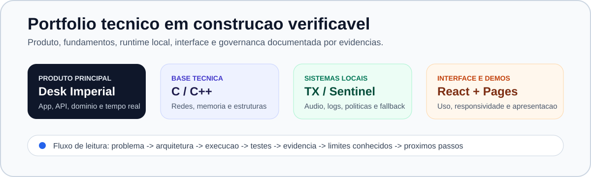

<h1 align="center">João Victor de Moraes da Cruz</h1>

  <strong>Engenharia de Software | produto full-stack | sistemas locais | C/C++ e redes</strong> 
  Saquarema, RJ | Brasil

  
  
  
  
  

  

---

## O que eu estou construindo

Eu uso este GitHub como índice público do meu trabalho técnico. Quando alguém entra aqui, quero que consiga entender quatro coisas sem depender de explicação minha: o que eu construí, como o projeto roda, que decisão técnica sustenta a entrega e qual evidência mostra que aquilo funciona.

Hoje, meu projeto principal é o [Desk Imperial](https://github.com/Victorzinn704/Desk-Imperial-Open-Source), uma plataforma full-stack para gestão comercial. Em paralelo, mantenho projetos menores para aprofundar base de C/C++, redes, frontend, runtime local, automação e documentação técnica.

<table>
<tr>
<td align="center" width="25%">
<strong>6</strong> 
repositórios de referência
</td>
<td align="center" width="25%">
<strong>3</strong> 
frentes publicadas: app, API e Pages
</td>
<td align="center" width="25%">
<strong>4</strong> 
trilhas técnicas principais
</td>
<td align="center" width="25%">
<strong>1</strong> 
padrão de governança para README, testes e evidências
</td>
</tr>
</table>

## Mapa técnico

| Frente | Repositório | O que eu mostro ali | Evidência pública | Onde está hoje |
| --- | --- | --- | --- | --- |
| Produto principal | [Desk Imperial](https://github.com/Victorzinn704/Desk-Imperial-Open-Source) | Produto full-stack com domínio comercial, autenticação, API, frontend, banco de dados, tempo real e testes. | App e API publicados, documentação técnica, workflows e histórico de manutenção. | É a base mais completa do perfil. |
| C, C++ e redes | [Aprendendo em C e C++](https://github.com/Victorzinn704/Aprendendo-em-C-e-C-) | Fundamentos de C/C++, estruturas de dados, simulação de rede, terminal e demo web. | GitHub Pages, guia de ambiente, matriz de testes, screenshots e código nativo. | Estou usando como trilha de estudo aplicado. |
| Runtime local | [TX - Tradutor em REALTIME](https://github.com/Victorzinn704/TX-Tradutor-em-REALTIME) | Captura de áudio, processamento contínuo, ASR, fallback, Python, Rust e validação local. | Documentação técnica, testes Python/Rust e matriz de evidências. | Projeto para explorar tempo real e máquina local. |
| Operação e controle | [Project Sentinel](https://github.com/Victorzinn704/project-sentinel) | Servidor local em Go, políticas de permissão, auditoria, SQLite e execução autorizada. | CI com testes Go, build e documentação operacional. | Base para automação com controle e rastreabilidade. |
| Frontend aplicado | [Gerenciador de Tarefas](https://github.com/Victorzinn704/Gerenciador-de-Tarefas-) | React, estado de interface, tema claro/escuro, responsividade e fluxo de tarefas. | GitHub Pages, testes e documentação de casos de uso. | Referência simples de interface publicada. |
| Produto em estabilização | [RH Insights](https://github.com/Victorzinn704/RH-Insights) | SaaS multi-tenant com Firebase, regras de isolamento, módulos administrativos e documentação. | CI restaurado, audit corrigido, regras documentadas e backlog técnico registrado. | Projeto mantido como estabilização de produto. |

---

## Meu padrão para um repositório bom

Eu tento deixar cada projeto importante avaliável por leitura e por execução. Para isso, procuro responder estas perguntas dentro do próprio repositório:

| Pergunta | O que eu documento |
| --- | --- |
| Para que isso existe? | Problema, público, escopo e limite do projeto. |
| Como eu rodo? | Ambiente, dependências, comandos e fluxo básico de uso. |
| Como eu valido? | Testes, casos de uso, resultado esperado e comandos de verificação. |
| Como eu provo? | Screenshots, logs não sensíveis, CI, GitHub Pages, app publicado ou API disponível. |
| Onde pode falhar? | Erros conhecidos, decisões de arquitetura, entradas inválidas e pontos de atenção. |
| O que vem depois? | Backlog técnico, próximos passos e estado real da entrega. |

Nem todo repositório antigo está nesse nível ainda. Os projetos do mapa acima são os que eu uso como referência principal para avaliação técnica.

---

## Como meus projetos se conectam

O [Desk Imperial](https://github.com/Victorzinn704/Desk-Imperial-Open-Source) puxa a parte de produto: regra de negócio, banco, API, frontend, autenticação, operação em tempo real, financeiro, estoque, vendas, folha, testes e documentação. É onde eu exercito manutenção de uma base maior.

O [Aprendendo em C e C++](https://github.com/Victorzinn704/Aprendendo-em-C-e-C-) fica na base: memória, ponteiros, estruturas de dados, simulação de rede e terminal. Eu quero que esse repositório seja simples de compilar, fácil de explicar e útil para demonstrar fundamentos sem depender só de texto.

O [TX - Tradutor em REALTIME](https://github.com/Victorzinn704/TX-Tradutor-em-REALTIME) e o [Project Sentinel](https://github.com/Victorzinn704/project-sentinel) entram na parte de sistemas locais. Neles eu trabalho com execução contínua, fallback, logs, políticas, SQLite, Go, Python e Rust.

O [Gerenciador de Tarefas](https://github.com/Victorzinn704/Gerenciador-de-Tarefas-) e as demos web do repositório de C/C++ ficam na camada de interface: layout, estado, tema, responsividade e uma apresentação mais clara para quem não quer começar pelo terminal.

---

## Stack que aparece de verdade

| Área | Ferramentas |
| --- | --- |
| Frontend | React, Next.js, TypeScript, Vite, Tailwind CSS, PWA, Framer Motion, Zod |
| Backend | Node.js, NestJS, Prisma, PostgreSQL, Redis, Socket.IO, Firebase, Firestore |
| Sistemas | C, C++, Python, Rust, Go, PowerShell, SQLite, WASAPI, CUDA, CTranslate2 |
| Qualidade | GitHub Actions, Jest, Vitest, Playwright, pytest, cargo test, ESLint, TypeScript check |
| Observabilidade | SonarQube, Grafana, Prometheus, k6, logs estruturados, health checks |
| Publicação | Docker, Linux, Oracle Cloud, Railway, Vercel, GitHub Pages, Cloudflare |

---

## Indicadores públicos

Estes gráficos são leitura complementar do GitHub. Eu não uso isso como substituto de documentação ou teste; eles ajudam a ver atividade pública, linguagem e distribuição geral do perfil.

  <picture>
    <source media="(prefers-color-scheme: dark)" srcset="https://github-readme-stats.vercel.app/api?username=Victorzinn704&show_icons=true&include_all_commits=true&rank_icon=github&hide_border=true&theme=github_dark&locale=pt-br">
    
  </picture>
  <picture>
    <source media="(prefers-color-scheme: dark)" srcset="https://github-readme-stats.vercel.app/api/top-langs/?username=Victorzinn704&layout=compact&langs_count=8&hide_border=true&theme=github_dark&locale=pt-br">
    
  </picture>

---

## Se você está avaliando meu perfil

O melhor caminho é começar pelos repositórios fixados e olhar nesta ordem:

1. README do projeto, para entender objetivo, stack, status e execução local.
2. Documentação de arquitetura, casos de uso ou matriz de testes.
3. Evidência de funcionamento: app, API, GitHub Pages, screenshots, logs ou CI.
4. Workflows e comandos de teste, quando o projeto tiver pipeline.
5. Limites conhecidos e próximos passos, para separar o que está pronto do que ainda está em evolução.

---

## Foco atual

| Área | Agora | Próximo passo |
| --- | --- | --- |
| Perfil GitHub | Deixar o perfil mais técnico, navegável e menos poluído. | Alinhar pins, descrições, tópicos e links públicos. |
| Desk Imperial | Manter o produto principal com app, API, documentação e testes. | Reduzir ruído técnico e melhorar evidências de uso. |
| C/C++ e redes | Consolidar estudo aplicado com código nativo, demo e documentação. | Expandir C++, melhorar screenshots e reforçar testes. |
| Frontend | Publicar demos úteis, não só telas soltas. | Padronizar tema claro/escuro, responsividade e componentes. |
| Operação local | Evoluir TX e Project Sentinel como projetos de runtime e controle. | Melhorar guias de instalação e validação em máquina limpa. |

---

## English summary

I am a Software Engineering student from Brazil. My main project is [Desk Imperial](https://github.com/Victorzinn704/Desk-Imperial-Open-Source), an open source full-stack platform for commercial operations with a published app, API, real-time flows, tests and technical documentation.

I organize this profile as a technical portfolio. For each relevant repository, I try to make the problem, architecture, local setup, tests, evidence, current limits and next steps easy to verify.
